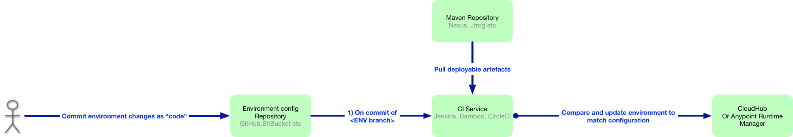

# Mule Deployments as Code

## Introduction
Once you have declared your deployment target state in a file, the target state can be realised simply by committing the file to a source control system. Mule DaC framework will parse the file (deployment descriptor) and compare with the environment and make the necessary changes.  For example, increase the number of workers in CloudHub for an application.



Adopt the framework as part of your **DevOps and CI/CD pipeline**.

 

The source code repository for environment management is separate from the application source code.

### The main advantages of the [Infrastructure as Code](https://en.wikipedia.org/wiki/Infrastructure_as_Code) approach:

- Framework allows for rollback to previously known state through [git revert](https://git-scm.com/docs/git-revert).
- Allows you deploy multiple applications update together or if you prefer a single application update.
- Decouple build and the promotion of code (binary) through the environments. 
- Compare configuration between environments and Know the deployment configuration of your environment any given time.

### Example of deployment descriptor file for CloudHub:
Target state is defined in the deployment descriptor file.
```yaml
CloudHub:  
  Env: "DEV"
  BusinessGroup: "MuleSoft"
  Applications:
    -
      name: "really-cool-api-v1"
      packageName: "really-cool-api-1.0.0-SNAPSHOT.zip"
      worker-size: "0.1"
      num-of-workers: "2"
      runtime: "3.8.5"
      region: "eu-west-1"
      properties: "really-cool-api-dev.properties"
      repo_endpoint: 'https://link-to-your-maven-repository.com/snapshots/'
    -
      name: "another-really-cool-api-v1"
      packageName: "another-really-cool-api-1.0.0-SNAPSHOT.zip"
      worker-size: "1"
      num-of-workers: "1"
      runtime: "3.8.5"
      region: "eu-west-1"
      properties: "another-really-cool-api-1.0.0-dev.properties"
      repo_endpoint: 'https://link-to-your-maven-repository.com/snapshots/'
```

## Framework Logic

* If the **application is not already deployed** then deploy the application. 
    * Field `name` is used as the unique identifier for the application. 
* If the **application is already deployed**, then update deployment if there are any changes in:
    * Application version
        * Field `packageName` is used to compare application version. The application version will be parsed using the maven convention.
    * Worker Configuration
        * Worker size
        * Number of Workers
        * Runtime
        * Region
    * Application Properties
    * CloudHub Properties

## How do I get started?

1. Create source code repository to host your configuration or fork this repository.
1. Create a branch for the environment. Each environment will require a branch. 
1. Copy of the contents of this repository into your branch if you did not fork this repository.
1. Configure your CI-Server and trigger execution on commit
```sh
$ .muleci/deployment.sh deployment_descriptor.yml
```
Use the same command to trigger deployment from your local development workstation.
1. Configure the Anypoint platform credentials as environment variables in your CI server:
    * anypoint_username
    * anypoint_password
1. Update `deployment_descriptor.yml` with:
    * Env
    * Business Group
    * Applications
    * Applications properties
1. Commit and push
   
### How do I update application properties?
Application Properties are maintained based on a folder structure convention. If the property file is empty, no properties will be updated during deployment.

```
app_properties/[app.name]/[app.name]-[branch].properties
```
* `app.name` is the `name` field in `deployment_descriptor.yml`

Example:
```
app_properties/really-cool-api-v1/really-cool-api-dev.properties
```

## Roadmap
More info on [Git Project page](https://github.com/mulesoft-consulting/MuleSoft_DeploymentAsCode/projects/1)

| Feature | Deployment Target | Status  | Additional details |
| --- | --- | --- | --- |
| Deploy Application  | CloudHub  | Completed | |
| Application properties | CloudHub | Completed | |
| Worker Configuration | CloudHub | Completed | runtime version, worker size, num of workers  |
| CloudHub properties | CloudHub |  | persistence queue, static ips |
| [Default configuration for CircelCI](https://github.com/mulesoft-consulting/MuleSoft_DeploymentAsCode/tree/master/.circleci) | CircleCI | Completed | |
| Create a full example with sample apps | CloudHub |  |  |
| Deploy Applications | Anypoint Runtime Manager  |  | |
| Application properties | Anypoint Runtime Manager |  | |

## Pre-requisites:
- [Anypoint-cli](https://docs.mulesoft.com/runtime-manager/anypoint-platform-cli#installation)
- [Nodes.js](https://nodejs.org/)
- CI or automation server
    - Such as Jenkins, Bamboo, CirecleCi, Ansible, Chef, Puppet etc.
- Build pipeline that published build artefacts into a store
- Store for application binaries
    -  Preferably maven repository server, such as Nexus, JFrog, etc.

#### Anypoint-cli
Command Line Interface for Anypoint Platform([Anypoint-CLI](https://docs.mulesoft.com/runtime-manager/anypoint-platform-cli)) is used to:
* Get information about deployed applications.
* Update application runtime, e.g. number of Workers.
* Update or deploy application.

#### Node.js
Anypoint-CLI is written in node.js hence the framework has been written in node.js to reduce dependencies.

## Recommendations:
- Create a branch per environment 
- No merging between branches

## Contributors
- Jeyaram Deivachandran
- Igor Repka
